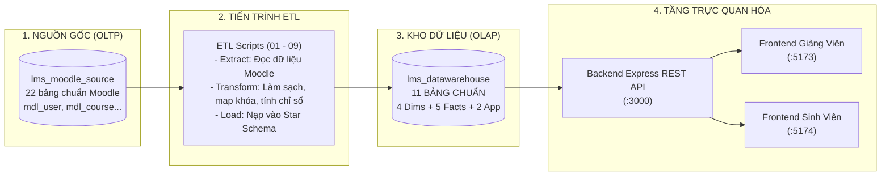

# TÀI LIỆU TOÀN TẬP VỀ CƠ SỞ DỮ LIỆU & QUY TRÌNH ETL
## HỆ THỐNG DASHBOARD PHÂN TÍCH & TRỰC QUAN HÓA DỮ LIỆU HỌC TẬP (LMS DATA WAREHOUSE)

---

> [!NOTE]
> **Mục đích tài liệu**: Cung cấp toàn bộ kiến thức chi tiết, chuẩn xác từ mã nguồn và cơ sở dữ liệu thực tế về **11 bảng trong Data Warehouse**, mối quan hệ liên kết (Star Schema), nguồn dữ liệu gốc từ Moodle LMS, quy trình trích xuất - biến đổi - nạp (ETL Pipeline), và bộ câu hỏi phản biện bảo vệ đồ án.

---

## MỤC LỤC
1. [Kiến trúc Tổng quan: Hai tầng CSDL (OLTP vs OLAP)](#1-kiến-trúc-tổng-quan-hai-tầng-csdl-oltp-vs-olap)
2. [Sơ đồ Hình Sao (Star Schema) & Tổng quan 11 Bảng](#2-sơ-đồ-hình-sao-star-schema--tổng-quan-11-bảng)
3. [Chi tiết Từ điển Dữ liệu 11 Bảng (Data Dictionary)](#3-chi-tiết-từ-điển-dữ-liệu-11-bảng-data-dictionary)
   - [3.1. Nhóm 4 Bảng Chiều (Dimension Tables)](#31-nhóm-4-bảng-chiều-dimension-tables)
   - [3.2. Nhóm 5 Bảng Sự Kiện (Fact Tables)](#32-nhóm-5-bảng-sự-kiện-fact-tables)
   - [3.3. Nhóm 2 Bảng Nghiệp Vụ Ứng Dụng (Application Tables)](#33-nhóm-2-bảng-nghiệp-vụ-ứng-dụng-application-tables)
4. [Sơ đồ Kết nối Thực thể & Ma trận Khóa (Entity Relationships)](#4-sơ-đồ-kết-nối-thực-thể--ma-trận-khóa-entity-relationships)
5. [Quy trình ETL Toàn tập: Moodle Source $\rightarrow$ Data Warehouse](#5-quy-trình-etl-toàn-tập-moodle-source--data-warehouse)
6. [Các Kịch bản Truy vấn Điển hình của Backend](#6-các-kịch-bản-truy-vấn-điển-hình-của-backend)
7. [Bộ Câu hỏi & Trả lời Bảo vệ Đồ án (Defense Q&A Cheat Sheet)](#7-bộ-câu-hỏi--trả-lời-bảo-vệ-đồ-án-defense-qa-cheat-sheet)

---

## 1. Kiến trúc Tổng quan: Hai tầng CSDL (OLTP vs OLAP)

Hệ thống được thiết kế theo chuẩn kiến trúc kho dữ liệu doanh nghiệp (Enterprise Data Warehouse), tách bạch hoàn toàn giữa hệ thống vận hành và hệ thống phân tích:



### Tại sao không truy vấn trực tiếp từ CSDL Moodle mà phải xây dựng Data Warehouse?
1. **Tránh nghẽn hệ thống học tập (Locking & Performance)**: Moodle sử dụng mô hình OLTP (Online Transaction Processing) chuẩn hóa 3NF để người dùng làm bài, nộp bài, click tài liệu theo thời gian thực. Nếu chạy các truy vấn phân tích, tổng hợp (Aggregation, GROUP BY) với hàng triệu bản ghi log trực tiếp trên CSDL Moodle, hệ thống sẽ bị treo hoặc khóa bảng (Table lock).
2. **Cấu trúc Moodle phân mảnh & phức tạp**: Moodle lưu trữ dưới dạng thực thể mở rộng, bảng `mdl_logstore_standard_log` ghi nhận hàng chục triệu bản ghi thô; điểm số phân tán qua `mdl_grade_items`, `mdl_grade_grades`, module học liệu chia nhỏ ra `mdl_assign`, `mdl_quiz`, `mdl_resource`, `mdl_page`, `mdl_url`.
3. **Mô hình Star Schema tối ưu cho BI & Trực quan hóa**: Giúp các câu lệnh JOIN trở nên đơn giản, tốc độ phản hồi API dưới 50ms, tính toán sẵn các chỉ số kinh doanh như: nộp bài đúng hạn hay trễ hạn (`Is_Submitted_On_Time`), tỷ lệ phần trăm điểm (`Grade_Percentage`), tổng số giây tương tác (`Time_Spent_Seconds`).

---

## 2. Sơ đồ Hình Sao (Star Schema) & Tổng quan 11 Bảng

Data Warehouse `lms_datawarehouse` được cấu trúc thành **11 bảng** thuộc 3 nhóm chính:

```mermaid
classDiagram
    %% Dimension Tables
    class Dim_Date {
        int Date_Key [PK]
        date Full_Date
        tinyint Month_Number
        smallint Year_Number
        varchar Academic_Semester
    }
    class Dim_User {
        int User_Key [PK]
        bigint Moodle_User_ID [UK]
        varchar Full_Name
        varchar Primary_Role
        boolean Is_Active
    }
    class Dim_Course {
        int Course_Key [PK]
        bigint Moodle_Course_ID [UK]
        varchar Course_Code
        varchar Course_Name
        date Start_Date
        date End_Date
    }
    class Dim_Activity {
        int Activity_Key [PK]
        bigint Moodle_Module_ID [UK]
        int Course_Key [FK]
        varchar Activity_Type
        varchar Activity_Name
        int Due_Date_Key [FK]
        decimal Max_Grade
    }

    %% Fact Tables
    class Fact_Enrolment {
        bigint Enrolment_Key [PK]
        int User_Key [FK]
        int Course_Key [FK]
        int Enrol_Date_Key [FK]
        int Unenrol_Date_Key [FK]
        varchar Status
    }
    class Fact_Assignment_Submission {
        bigint Submission_Key [PK]
        int User_Key [FK]
        int Course_Key [FK]
        int Activity_Key [FK]
        int Submit_Date_Key [FK]
        int Due_Date_Key [FK]
        boolean Is_Submitted_On_Time
        decimal Grade
        boolean Is_Graded
    }
    class Fact_Course_Grade {
        bigint Grade_Key [PK]
        int User_Key [FK]
        int Course_Key [FK]
        int Activity_Key [FK]
        int Date_Key [FK]
        decimal Grade
        decimal Grade_Percentage
        boolean Is_Passed
    }
    class Fact_Daily_Engagement {
        bigint Engagement_Key [PK]
        int User_Key [FK]
        int Course_Key [FK]
        int Date_Key [FK]
        bigint Time_Spent_Seconds
        datetime Last_Access_Time
    }
    class Fact_Module_Engagement {
        bigint Module_Engagement_Key [PK]
        int User_Key [FK]
        int Course_Key [FK]
        int Activity_Key [FK]
        int Date_Key [FK]
        bigint Time_Spent_Seconds
    }

    %% Application Tables
    class App_User_Account {
        int Account_ID [PK]
        int User_Key [FK]
        varchar Username
        varchar Password_Hash
        varchar Role
    }
    class Teacher_Schedule {
        bigint Schedule_ID [PK]
        int Teacher_User_Key [FK]
        date Event_Date
        time Event_Time
        varchar Title
        varchar Event_Type
    }

    %% Relationships Dim_Activity
    Dim_Course "1" --> "0..*" Dim_Activity : Course_Key
    Dim_Date "1" --> "0..*" Dim_Activity : Due_Date_Key

    %% Relationships Fact_Enrolment
    Dim_User "1" --> "0..*" Fact_Enrolment : User_Key
    Dim_Course "1" --> "0..*" Fact_Enrolment : Course_Key
    Dim_Date "1" --> "0..*" Fact_Enrolment : Enrol_Date_Key
    Dim_Date "1" --> "0..*" Fact_Enrolment : Unenrol_Date_Key

    %% Relationships Fact_Assignment_Submission
    Dim_User "1" --> "0..*" Fact_Assignment_Submission : User_Key
    Dim_Course "1" --> "0..*" Fact_Assignment_Submission : Course_Key
    Dim_Activity "1" --> "0..*" Fact_Assignment_Submission : Activity_Key
    Dim_Date "1" --> "0..*" Fact_Assignment_Submission : Submit_Date_Key
    Dim_Date "1" --> "0..*" Fact_Assignment_Submission : Due_Date_Key

    %% Relationships Fact_Course_Grade
    Dim_User "1" --> "0..*" Fact_Course_Grade : User_Key
    Dim_Course "1" --> "0..*" Fact_Course_Grade : Course_Key
    Dim_Activity "1" --> "0..*" Fact_Course_Grade : Activity_Key
    Dim_Date "1" --> "0..*" Fact_Course_Grade : Date_Key

    %% Relationships Fact_Daily_Engagement
    Dim_User "1" --> "0..*" Fact_Daily_Engagement : User_Key
    Dim_Course "1" --> "0..*" Fact_Daily_Engagement : Course_Key
    Dim_Date "1" --> "0..*" Fact_Daily_Engagement : Date_Key

    %% Relationships Fact_Module_Engagement
    Dim_User "1" --> "0..*" Fact_Module_Engagement : User_Key
    Dim_Course "1" --> "0..*" Fact_Module_Engagement : Course_Key
    Dim_Activity "1" --> "0..*" Fact_Module_Engagement : Activity_Key
    Dim_Date "1" --> "0..*" Fact_Module_Engagement : Date_Key

    %% Operational
    Dim_User "1" --> "1" App_User_Account : User_Key
    Dim_User "1" --> "0..*" Teacher_Schedule : Teacher_User_Key
```



### Bảng Tóm tắt 11 Bảng trong Data Warehouse:

| STT | Tên Bảng | Loại Bảng | Số Dòng Thực Tế | Ý Nghĩa Nghiệp Vụ Chính |
| :--- | :--- | :--- | :--- | :--- |
| 1 | `dim_date` | Dimension | 5,844 dòng | Chiều thời gian từ 2020-2035 (Ngày, Tháng, Quý, Năm, Học kỳ). |
| 2 | `dim_user` | Dimension | 14 dòng | Người dùng (Giảng viên, Sinh viên, Tên, Mã số, Email, Vai trò). |
| 3 | `dim_course` | Dimension | 4 dòng | Các khóa học (Cơ sở dữ liệu, Lập trình Web, AI, Cấu trúc dữ liệu). |
| 4 | `dim_activity` | Dimension | 12 dòng | Hoạt động & Học liệu (Bài tập, Quiz, Slide PDF, Hướng dẫn, Video). |
| 5 | `fact_enrolment` | Fact | 24 dòng | Sự kiện ghi danh của người dùng vào các khóa học. |
| 6 | `fact_assignment_submission` | Fact | 48 dòng | Sự kiện nộp bài tập (Thời gian nộp, Đúng hạn/Trễ hạn, Điểm, Nhận xét). |
| 7 | `fact_course_grade` | Fact | 54 dòng | Điểm số các bài tập, quiz và điểm tổng kết khóa học. |
| 8 | `fact_daily_engagement` | Fact | 1,512 dòng | Thời gian học tương tác hàng ngày của sinh viên trong từng môn học (giây). |
| 9 | `fact_module_engagement` | Fact | 4,536 dòng | Thời gian tương tác chi tiết vào từng bài tập / học liệu cụ thể (giây). |
| 10 | `app_user_account` | Application | 14 dòng | Tài khoản đăng nhập, mật khẩu mã hóa bcrypt, phân quyền `teacher`/`student`. |
| 11 | `teacher_schedule` | Application | (Động) | Lịch giảng dạy, lịch thi, sự kiện cá nhân của giảng viên trên dashboard. |

---

## 3. Chi tiết Từ điển Dữ liệu 11 Bảng (Data Dictionary)

---

### 3.1. Nhóm 4 Bảng Chiều (Dimension Tables)

#### 1. Bảng `dim_date` (Chiều Thời Gian)
- **Hạt dữ liệu (Grain)**: Mỗi dòng đại diện cho đúng **1 ngày theo lịch**.
- **Khóa chính**: `Date_Key` định dạng số nguyên `YYYYMMDD` (Ví dụ: `20260115` đại diện cho ngày `15/01/2026`).

| Tên Cột | Kiểu Dữ Liệu | Ràng Buộc | Ý Nghĩa Nghiệp Vụ |
| :--- | :--- | :--- | :--- |
| `Date_Key` | `INT` | **PRIMARY KEY** | Khóa thay thế dạng số nguyên `YYYYMMDD` |
| `Full_Date` | `DATE` | NOT NULL, UNIQUE | Ngày đầy đủ (`2026-01-15`) |
| `Day_Of_Month` | `TINYINT` | NOT NULL | Ngày trong tháng (1 - 31) |
| `Month_Number` | `TINYINT` | NOT NULL | Tháng trong năm (1 - 12) |
| `Month_Name` | `VARCHAR(20)` | NOT NULL | Tên tháng tiếng Anh/Việt ('January'...) |
| `Quarter_Number` | `TINYINT` | NOT NULL | Quý trong năm (1, 2, 3, 4) |
| `Year_Number` | `SMALLINT` | NOT NULL, INDEX | Năm (`2026`) |
| `Week_Number` | `TINYINT` | NOT NULL | Tuần trong năm (1 - 53) |
| `Day_Of_Week_Number` | `TINYINT` | NOT NULL | Thứ trong tuần (1 = Chủ nhật, 2 = Thứ hai...) |
| `Day_Of_Week_Name` | `VARCHAR(20)` | NOT NULL | Tên thứ ('Monday', 'Tuesday'...) |
| `Is_Weekend` | `BOOLEAN` | NOT NULL DEFAULT FALSE | Cờ xác định ngày cuối tuần (T7, CN) |
| `Academic_Semester` | `VARCHAR(30)` | INDEX | Tên học kỳ ('Học kỳ 1 (2026-2027)') |

---

#### 2. Bảng `dim_user` (Chiều Người Dùng)
- **Hạt dữ liệu (Grain)**: Mỗi dòng đại diện cho **1 người dùng** (Giảng viên hoặc Sinh viên) trong hệ thống LMS.
- **Nguồn từ Moodle**: `mdl_user`, `mdl_role_assignments`, `mdl_role`.

| Tên Cột | Kiểu Dữ Liệu | Ràng Buộc | Ý Nghĩa Nghiệp Vụ |
| :--- | :--- | :--- | :--- |
| `User_Key` | `INT` | **PRIMARY KEY**, AUTO_INCREMENT | Khóa thay thế (Surrogate Key) nội bộ DW |
| `Moodle_User_ID` | `BIGINT` | NOT NULL, UNIQUE, INDEX | ID tự nhiên từ bảng `mdl_user.id` của Moodle |
| `Username` | `VARCHAR(100)` | NULL | Tên đăng nhập (`gv_cntt_01`, `sv2310001`...) |
| `First_Name` | `VARCHAR(100)` | NULL | Tên người dùng (`An`, `Bình`...) |
| `Last_Name` | `VARCHAR(100)` | NULL | Họ và tên đệm (`Nguyễn Văn`, `Trần Thị`...) |
| `Full_Name` | `VARCHAR(255)` | NOT NULL, INDEX | Họ và tên đầy đủ đã chuẩn hóa TRIM() |
| `Email` | `VARCHAR(255)` | NULL | Địa chỉ thư điện tử |
| `Primary_Role` | `VARCHAR(50)` | INDEX | Vai trò chính: `'Teacher'`, `'Student'`, `'Unknown'` |
| `Is_Active` | `BOOLEAN` | NOT NULL DEFAULT TRUE | Trạng thái tài khoản còn hiệu lực hay không |

---

#### 3. Bảng `dim_course` (Chiều Khóa Học)
- **Hạt dữ liệu (Grain)**: Mỗi dòng đại diện cho **1 khóa học (học phần)** trong hệ thống.
- **Nguồn từ Moodle**: `mdl_course`, `mdl_course_categories`.

| Tên Cột | Kiểu Dữ Liệu | Ràng Buộc | Ý Nghĩa Nghiệp Vụ |
| :--- | :--- | :--- | :--- |
| `Course_Key` | `INT` | **PRIMARY KEY**, AUTO_INCREMENT | Khóa thay thế nội bộ DW |
| `Moodle_Course_ID` | `BIGINT` | NOT NULL, UNIQUE, INDEX | ID khóa học gốc từ `mdl_course.id` |
| `Course_Code` | `VARCHAR(100)` | INDEX | Mã học phần (`CS301`, `WEB302`, `AI401`...) |
| `Course_Name` | `VARCHAR(255)` | NOT NULL, INDEX | Tên đầy đủ học phần ('Cơ sở dữ liệu'...) |
| `Category_ID` | `BIGINT` | INDEX | Mã danh mục khoa/bộ môn quản lý |
| `Category_Name` | `VARCHAR(255)` | NULL | Tên danh mục ('Khoa Công nghệ Thông tin') |
| `Start_Date` | `DATE` | NULL | Ngày bắt đầu môn học |
| `End_Date` | `DATE` | NULL | Ngày kết thúc môn học |
| `Is_Visible` | `BOOLEAN` | NOT NULL DEFAULT TRUE | Trạng thái khóa học đang mở cho sinh viên |

---

#### 4. Bảng `dim_activity` (Chiều Hoạt Động & Học Liệu)
- **Hạt dữ liệu (Grain)**: Mỗi dòng đại diện cho **1 hoạt động học tập hoặc học liệu** (Assignment, Quiz, File PDF, Trang bài đọc, Video).
- **Nguồn từ Moodle**: `mdl_course_modules`, `mdl_modules`, `mdl_assign`, `mdl_quiz`, `mdl_resource`, `mdl_page`, `mdl_url`.

| Tên Cột | Kiểu Dữ Liệu | Ràng Buộc | Ý Nghĩa Nghiệp Vụ |
| :--- | :--- | :--- | :--- |
| `Activity_Key` | `INT` | **PRIMARY KEY**, AUTO_INCREMENT | Khóa thay thế nội bộ DW |
| `Moodle_Module_ID` | `BIGINT` | NOT NULL, UNIQUE | ID Course Module từ `mdl_course_modules.id` |
| `Course_Key` | `INT` | NOT NULL, **FOREIGN KEY** | Liên kết tới `Dim_Course(Course_Key)` |
| `Activity_Type` | `VARCHAR(50)` | NOT NULL, INDEX | Loại hoạt động: `'assign'`, `'quiz'`, `'resource'`, `'page'`, `'url'` |
| `Activity_Name` | `VARCHAR(255)` | NULL | Tên bài tập / bài kiểm tra / tài liệu |
| `Due_Date_Key` | `INT` | NULL, **FOREIGN KEY** | Hạn nộp, liên kết tới `Dim_Date(Date_Key)` |
| `Max_Grade` | `DECIMAL(10,2)`| NULL | Điểm tối đa của bài (Ví dụ: `10.00`, `100.00`) |
| `Is_Visible` | `BOOLEAN` | NOT NULL DEFAULT TRUE | Cờ hiển thị hoạt động đối với sinh viên |

---

### 3.2. Nhóm 5 Bảng Sự Kiện (Fact Tables)

#### 5. Bảng `fact_enrolment` (Fact Ghi Danh Môn Học)
- **Hạt dữ liệu (Grain)**: Mỗi dòng ghi nhận **1 lần một người dùng được ghi danh vào một khóa học cụ thể**.
- **Nguồn từ Moodle**: `mdl_user_enrolments`, `mdl_enrol`.

| Tên Cột | Kiểu Dữ Liệu | Ràng Buộc | Ý Nghĩa Nghiệp Vụ |
| :--- | :--- | :--- | :--- |
| `Enrolment_Key` | `BIGINT` | **PRIMARY KEY**, AUTO_INCREMENT | Khóa dòng sự kiện ghi danh |
| `User_Key` | `INT` | NOT NULL, **FOREIGN KEY** | Người dùng, tham chiếu `Dim_User(User_Key)` |
| `Course_Key` | `INT` | NOT NULL, **FOREIGN KEY** | Khóa học, tham chiếu `Dim_Course(Course_Key)` |
| `Enrol_Date_Key` | `INT` | NOT NULL, **FOREIGN KEY** | Ngày ghi danh, tham chiếu `Dim_Date(Date_Key)` |
| `Unenrol_Date_Key` | `INT` | NULL, **FOREIGN KEY** | Ngày hủy ghi danh (nếu có), tham chiếu `Dim_Date` |
| `Status` | `VARCHAR(30)` | NOT NULL DEFAULT 'Active' | Trạng thái ghi danh: `'Active'`, `'Inactive'` |

---

#### 6. Bảng `fact_assignment_submission` (Fact Nộp Bài Tập)
- **Hạt dữ liệu (Grain)**: Mỗi dòng ghi nhận **1 lần nộp bài tập (Assignment)** của 1 sinh viên cho 1 bài tập cụ thể.
- **Nguồn từ Moodle**: `mdl_assign_submission`, `mdl_assign`, `mdl_assign_grades`, `mdl_assignfeedback_comments`.

| Tên Cột | Kiểu Dữ Liệu | Ràng Buộc | Ý Nghĩa Nghiệp Vụ |
| :--- | :--- | :--- | :--- |
| `Submission_Key` | `BIGINT` | **PRIMARY KEY**, AUTO_INCREMENT | Khóa dòng sự kiện nộp bài |
| `User_Key` | `INT` | NOT NULL, **FOREIGN KEY** | Sinh viên nộp bài, tham chiếu `Dim_User` |
| `Course_Key` | `INT` | NOT NULL, **FOREIGN KEY** | Môn học chứa bài nộp, tham chiếu `Dim_Course` |
| `Activity_Key` | `INT` | NOT NULL, **FOREIGN KEY** | Bài tập được nộp, tham chiếu `Dim_Activity` |
| `Submit_Date_Key` | `INT` | NULL, **FOREIGN KEY** | Ngày nộp thực tế, tham chiếu `Dim_Date` |
| `Due_Date_Key` | `INT` | NULL, **FOREIGN KEY** | Hạn nộp quy định của bài tập, tham chiếu `Dim_Date` |
| `Attempt_Number` | `INT` | NOT NULL DEFAULT 0 | Lần nộp thứ mấy (0, 1, 2...) |
| `Submission_Status` | `VARCHAR(30)` | NOT NULL, INDEX | Trạng thái nộp: `'submitted'`, `'draft'`, `'new'` |
| `Is_Submitted_On_Time` | `BOOLEAN` | NULL | **Chỉ số vàng**: `TRUE` nếu nộp đúng hạn, `FALSE` nếu trễ |
| `Grade` | `DECIMAL(10,2)`| NULL | Điểm bài nộp giảng viên đã chấm |
| `Is_Graded` | `BOOLEAN` | NOT NULL DEFAULT FALSE | Đã chấm điểm hay chưa (phục vụ lọc bài chờ chấm) |
| `Feedback_Comment` | `TEXT` | NULL | Nhận xét phản hồi của giảng viên |

---

#### 7. Bảng `fact_course_grade` (Fact Điểm Số Học Phần)
- **Hạt dữ liệu (Grain)**: Mỗi dòng ghi nhận **1 điểm số thành phần hoặc tổng kết** của 1 sinh viên trong 1 môn học.
- **Nguồn từ Moodle**: `mdl_grade_grades`, `mdl_grade_items`.

| Tên Cột | Kiểu Dữ Liệu | Ràng Buộc | Ý Nghĩa Nghiệp Vụ |
| :--- | :--- | :--- | :--- |
| `Grade_Key` | `BIGINT` | **PRIMARY KEY**, AUTO_INCREMENT | Khóa dòng điểm số |
| `User_Key` | `INT` | NOT NULL, **FOREIGN KEY** | Sinh viên nhận điểm, tham chiếu `Dim_User` |
| `Course_Key` | `INT` | NOT NULL, **FOREIGN KEY** | Môn học, tham chiếu `Dim_Course` |
| `Grade_Item_ID` | `BIGINT` | NOT NULL, INDEX | Mã hạng mục điểm từ `mdl_grade_items.id` |
| `Grade_Item_Name` | `VARCHAR(255)`| NULL | Tên cột điểm ('Bài tập 1', 'Thi cuối kỳ', 'Course total') |
| `Grade_Item_Type` | `VARCHAR(50)` | NULL | Loại cột điểm: `'mod'` (bài tập), `'course'` (tổng kết) |
| `Activity_Key` | `INT` | NULL, **FOREIGN KEY** | Hoạt động tương ứng, tham chiếu `Dim_Activity` |
| `Date_Key` | `INT` | NULL, **FOREIGN KEY** | Ngày chấm điểm, tham chiếu `Dim_Date` |
| `Grade` | `DECIMAL(10,4)`| NULL | Điểm thực tế đạt được |
| `Max_Grade` | `DECIMAL(10,4)`| NULL | Điểm tối đa của hạng mục này |
| `Grade_Percentage` | `DECIMAL(7,4)`| NULL | **Chỉ số tỷ lệ %**: `(Grade / Max_Grade) * 100` |
| `Is_Passed` | `BOOLEAN` | NULL | Cờ đạt yêu cầu: `TRUE` nếu `Grade >= gradepass` |

---

#### 8. Bảng `fact_daily_engagement` (Fact Tương Tác Hàng Ngày)
- **Hạt dữ liệu (Grain)**: Mỗi dòng ghi nhận **tổng thời gian học tương tác của 1 sinh viên trong 1 môn học trong đúng 1 ngày**.
- **Nguồn từ Moodle**: Tính toán tổng hợp từ bảng log Moodle `mdl_local_course_daily_engagement` (hoặc `mdl_logstore_standard_log`).

| Tên Cột | Kiểu Dữ Liệu | Ràng Buộc | Ý Nghĩa Nghiệp Vụ |
| :--- | :--- | :--- | :--- |
| `Engagement_Key` | `BIGINT` | **PRIMARY KEY**, AUTO_INCREMENT | Khóa dòng sự kiện tương tác ngày |
| `User_Key` | `INT` | NOT NULL, **FOREIGN KEY** | Sinh viên học tập, tham chiếu `Dim_User` |
| `Course_Key` | `INT` | NOT NULL, **FOREIGN KEY** | Môn học được truy cập, tham chiếu `Dim_Course` |
| `Date_Key` | `INT` | NOT NULL, **FOREIGN KEY** | Ngày diễn ra tương tác, tham chiếu `Dim_Date` |
| `Time_Spent_Seconds` | `BIGINT` | NOT NULL DEFAULT 0 | Tổng thời lượng truy cập trong ngày (tính bằng giây) |
| `Last_Access_Time` | `DATETIME` | NULL | Thời điểm cuối cùng sinh viên truy cập môn học trong ngày |

---

#### 9. Bảng `fact_module_engagement` (Fact Tương Tác Chi Tiết Theo Module)
- **Hạt dữ liệu (Grain)**: Mỗi dòng ghi nhận **thời gian 1 sinh viên tương tác vào đúng 1 hoạt động cụ thể (Bài tập, Quiz, Tài liệu) trong 1 ngày**.
- **Nguồn từ Moodle**: `mdl_local_module_daily_engagement`.

| Tên Cột | Kiểu Dữ Liệu | Ràng Buộc | Ý Nghĩa Nghiệp Vụ |
| :--- | :--- | :--- | :--- |
| `Module_Engagement_Key` | `BIGINT` | **PRIMARY KEY**, AUTO_INCREMENT | Khóa dòng sự kiện tương tác module |
| `User_Key` | `INT` | NOT NULL, **FOREIGN KEY** | Sinh viên, tham chiếu `Dim_User` |
| `Course_Key` | `INT` | NOT NULL, **FOREIGN KEY** | Môn học, tham chiếu `Dim_Course` |
| `Activity_Key` | `INT` | NOT NULL, **FOREIGN KEY** | Hoạt động/tài liệu học, tham chiếu `Dim_Activity` |
| `Date_Key` | `INT` | NOT NULL, **FOREIGN KEY** | Ngày tương tác, tham chiếu `Dim_Date` |
| `Time_Spent_Seconds` | `BIGINT` | NOT NULL DEFAULT 0 | Số giây sinh viên dành riêng cho hoạt động đó |

> [!TIP]
> **Quy tắc Kiểm tra Tính toàn vẹn (Integrity Check)**:
> Tổng `Time_Spent_Seconds` trong `fact_module_engagement` của một ngày trong một môn học phải luôn bằng hoặc nhỏ hơn `Time_Spent_Seconds` trong `fact_daily_engagement`.

---

### 3.3. Nhóm 2 Bảng Nghiệp Vụ Ứng Dụng (Application Tables)

Hai bảng này được thiết kế để phục vụ các chức năng thực tiễn của Dashboard như: Đăng nhập an toàn & Quản lý lịch làm việc cá nhân của Giảng viên.

#### 10. Bảng `app_user_account` (Tài Khoản Đăng Nhập Hệ Thống)
- **Hạt dữ liệu (Grain)**: Mỗi dòng đại diện cho **1 tài khoản xác thực đăng nhập** liên kết 1-1 với một người dùng trong Data Warehouse.

| Tên Cột | Kiểu Dữ Liệu | Ràng Buộc | Ý Nghĩa Nghiệp Vụ |
| :--- | :--- | :--- | :--- |
| `Account_ID` | `INT` | **PRIMARY KEY**, AUTO_INCREMENT | Khóa tài khoản |
| `User_Key` | `INT` | NOT NULL, UNIQUE, **FOREIGN KEY** | Liên kết 1-1 tới `Dim_User(User_Key)` |
| `Username` | `VARCHAR(100)` | NOT NULL, UNIQUE, INDEX | Tên đăng nhập hệ thống |
| `Password_Hash` | `VARCHAR(255)` | NOT NULL | Mật khẩu đã được mã hóa một chiều bằng thư viện `bcrypt` |
| `Role` | `VARCHAR(50)` | NOT NULL DEFAULT 'teacher' | Quyền hạn: `'teacher'` (Giảng viên), `'student'` (Sinh viên) |
| `Is_Active` | `BOOLEAN` | NOT NULL DEFAULT TRUE | Tài khoản có được phép đăng nhập hay không |
| `Created_At` | `DATETIME` | NOT NULL DEFAULT CURRENT_TIMESTAMP | Thời điểm khởi tạo tài khoản |
| `Updated_At` | `DATETIME` | NOT NULL DEFAULT CURRENT_TIMESTAMP ON UPDATE | Thời điểm đổi mật khẩu/cập nhật cuối cùng |

---

#### 11. Bảng `teacher_schedule` (Lịch Giảng Dạy & Sự Kiện Giảng Viên)
- **Hạt dữ liệu (Grain)**: Mỗi dòng đại diện cho **1 sự kiện lịch** (Lịch lên lớp, Lịch thi, Deadline nộp điểm, Cuộc họp) của Giảng viên.

| Tên Cột | Kiểu Dữ Liệu | Ràng Buộc | Ý Nghĩa Nghiệp Vụ |
| :--- | :--- | :--- | :--- |
| `Schedule_ID` | `BIGINT` | **PRIMARY KEY**, AUTO_INCREMENT | Khóa sự kiện lịch |
| `Teacher_User_Key` | `INT` | NOT NULL, **FOREIGN KEY** | Giảng viên chủ sở hữu, tham chiếu `Dim_User` |
| `Event_Date` | `DATE` | NOT NULL, INDEX | Ngày diễn ra sự kiện |
| `Event_Time` | `TIME` | NULL | Giờ diễn ra sự kiện (Ví dụ: `07:30:00`) |
| `Title` | `VARCHAR(255)` | NOT NULL | Tiêu đề sự kiện ('Dạy thực hành CSDL Lớp CTK47B'...) |
| `Event_Type` | `VARCHAR(30)` | NOT NULL DEFAULT 'class' | Phân loại: `'class'` (lớp học), `'exam'` (thi), `'deadline'`, `'meeting'` |
| `Description` | `TEXT` | NULL | Nội dung chi tiết hoặc ghi chú phòng học |
| `Created_At` | `DATETIME` | NOT NULL DEFAULT CURRENT_TIMESTAMP | Thời điểm tạo lịch |
| `Updated_At` | `DATETIME` | NOT NULL DEFAULT CURRENT_TIMESTAMP ON UPDATE | Thời điểm sửa đổi lịch gần nhất |

---

## 4. Sơ đồ Kết nối Thực thể & Ma trận Khóa (Entity Relationships)

### 4.1. Ma trận Khóa Ngoại (Foreign Keys Matrix)

Toàn bộ các bảng Fact và Application kết nối với các bảng Dimension theo các ràng buộc khóa ngoại chặt chẽ:

```text
[Fact_Enrolment] ──────────────┬──> Dim_User(User_Key)
                               ├──> Dim_Course(Course_Key)
                               ├──> Dim_Date(Date_Key) [Enrol_Date_Key]
                               └──> Dim_Date(Date_Key) [Unenrol_Date_Key]

[Fact_Assignment_Submission] ──┬──> Dim_User(User_Key)
                               ├──> Dim_Course(Course_Key)
                               ├──> Dim_Activity(Activity_Key)
                               ├──> Dim_Date(Date_Key) [Submit_Date_Key]
                               └──> Dim_Date(Date_Key) [Due_Date_Key]

[Fact_Course_Grade] ───────────┬──> Dim_User(User_Key)
                               ├──> Dim_Course(Course_Key)
                               ├──> Dim_Activity(Activity_Key)
                               └──> Dim_Date(Date_Key) [Date_Key]

[Fact_Daily_Engagement] ───────┬──> Dim_User(User_Key)
                               ├──> Dim_Course(Course_Key)
                               └──> Dim_Date(Date_Key) [Date_Key]

[Fact_Module_Engagement] ──────┬──> Dim_User(User_Key)
                               ├──> Dim_Course(Course_Key)
                               ├──> Dim_Activity(Activity_Key)
                               └──> Dim_Date(Date_Key) [Date_Key]

[Dim_Activity] ────────────────┬──> Dim_Course(Course_Key)
                               └──> Dim_Date(Date_Key) [Due_Date_Key]

[App_User_Account] ────────────└──> Dim_User(User_Key) [ON DELETE CASCADE]
[Teacher_Schedule] ────────────└──> Dim_User(User_Key) [Teacher_User_Key ON DELETE CASCADE]
```

### 4.2. Khóa Tự Nhiên (Natural Key) vs Khóa Thay Thế (Surrogate Key)
- **Natural Key (Khóa nghiệp vụ)**: Là các ID xuất phát từ hệ thống Moodle gốc (`mdl_user.id`, `mdl_course.id`, `mdl_course_modules.id`). Các cột này được giữ lại trong Data Warehouse dưới dạng `UNIQUE` (ví dụ `Moodle_User_ID`, `Moodle_Course_ID`) để phục vụ quá trình đối chiếu ETL (Idempotent Load).
- **Surrogate Key (Khóa thay thế)**: Là các khóa chính dạng số nguyên tự tăng `INT AUTO_INCREMENT` (`User_Key`, `Course_Key`, `Activity_Key`).
  - *Lợi ích*: Giúp tối ưu hóa tốc độ JOIN trong CSDL MySQL, giảm dung lượng bộ nhớ đệm (Buffer Pool), bảo vệ tính độc lập của kho dữ liệu (nếu sau này kết nối thêm dữ liệu từ Google Classroom hay Edmodo, cấu trúc khóa của Data Warehouse vẫn giữ nguyên).

---

## 5. Quy trình ETL Toàn tập: Moodle Source $\rightarrow$ Data Warehouse

Quy trình ETL bao gồm 9 tệp SQL được thực thi theo thứ tự phụ thuộc (Dependencies) nghiêm ngặt:

```text
Thứ tự thực thi ETL Pipeline:
Bước 1: 01_etl_dim_user.sql                    (Nạp Dim_User)
Bước 2: 02_etl_dim_course.sql                  (Nạp Dim_Course)
Bước 3: 03_etl_dim_activity.sql                (Nạp Dim_Activity: Assign, Quiz)
Bước 4: 04_etl_fact_enrolment.sql              (Nạp Fact_Enrolment)
Bước 5: 05_etl_fact_assignment_submission.sql  (Nạp Fact_Assignment_Submission)
Bước 6: 06_etl_fact_course_grade.sql           (Nạp Fact_Course_Grade)
Bước 7: 07_etl_fact_daily_engagement.sql       (Nạp Fact_Daily_Engagement)
Bước 8: 08_etl_fact_module_engagement.sql      (Nạp Fact_Module_Engagement)
Bước 9: 09_etl_learning_resources.sql          (Mở rộng Dim_Activity: Resource, Page, URL)
```

### Chi tiết Các Phép Biến Đổi Nghiệp Vụ (Transformations) trong từng bước ETL:

#### 1. ETL `Dim_User` (`01_etl_dim_user.sql`)
- **Trích xuất (Extract)**: Từ `mdl_user`, `mdl_role_assignments`, `mdl_role`. Lọc `u.deleted = 0`.
- **Biến đổi (Transform)**:
  - Ghép họ và tên chuẩn xác: `TRIM(CONCAT(u.firstname, ' ', u.lastname))`.
  - Phân loại vai trò chính (`Primary_Role`): Dùng hàm điều kiện `CASE WHEN r.shortname IN ('teacher', 'editingteacher') THEN 'Teacher' WHEN r.shortname = 'student' THEN 'Student' ELSE 'Unknown' END`.
  - Xác định trạng thái: Nếu `u.suspended = 0 AND u.deleted = 0` thì `Is_Active = TRUE`.
- **Nạp (Load)**: Dùng cú pháp `ON DUPLICATE KEY UPDATE` để không xóa người dùng cũ (bảo toàn khóa ngoại cho các bảng Fact).

#### 2. ETL `Dim_Course` (`02_etl_dim_course.sql`)
- **Trích xuất & Biến đổi**:
  - Chuyển đổi timestamp Unix thời gian bắt đầu và kết thúc môn học: `FROM_UNIXTIME(c.startdate)` $\rightarrow$ kiểu `DATE`.
  - JOIN với `mdl_course_categories` để lấy tên Khoa/Ngành quản lý khóa học (`Category_Name`).

#### 3. ETL `Dim_Activity` (`03_etl_dim_activity.sql` & `09_etl_learning_resources.sql`)
- **Hợp nhất đa nguồn (Union-like Transformation)**:
  - Bảng `mdl_course_modules` kết hợp với `mdl_assign` (Bài nộp), `mdl_quiz` (Trắc nghiệm), `mdl_resource` (Slide/PDF), `mdl_page` (Bài đọc web), `mdl_url` (Video link).
  - Tra cứu ngày hết hạn: `duedate` (của Assign) hoặc `timeclose` (của Quiz) được ánh xạ sang `Dim_Date(Date_Key)`.

#### 4. ETL `Fact_Assignment_Submission` (`05_etl_fact_assignment_submission.sql`)
- **Xác định chỉ số quan trọng**:
  - `Is_Submitted_On_Time`: So sánh thời điểm nộp `s.timemodified` với hạn chót `a.duedate`. Nếu `timemodified <= duedate` thì `TRUE`, ngược lại `FALSE`.
  - Lấy lần nộp bài mới nhất: `WHERE s.latest = 1`.
  - Kết hợp bảng điểm `mdl_assign_grades` và phản hồi của giảng viên `mdl_assignfeedback_comments`.

#### 5. ETL `Fact_Course_Grade` (`06_etl_fact_course_grade.sql`)
- **Tính toán chỉ số điểm số**:
  - Tính tỷ lệ phần trăm chuẩn hóa 100%: `Grade_Percentage = (gg.finalgrade / gi.grademax) * 100`.
  - Xác định chuẩn đạt: So sánh `finalgrade >= gi.gradepass` $\rightarrow$ `Is_Passed = TRUE / FALSE`.

#### 6. ETL `Fact_Daily_Engagement` & `Fact_Module_Engagement` (`07_` & `08_`)
- **Đo lường thời gian tương tác (Time Delta Calculation)**:
  - Trong Moodle, mỗi lần sinh viên click xem tài liệu hay nộp bài, 1 log được ghi vào `mdl_logstore_standard_log`.
  - Kịch bản ETL tính toán khoảng cách thời gian giữa 2 sự kiện liên tiếp (Time delta) trong 1 phiên làm việc (Session), loại bỏ các khoảng thời gian treo máy > 30 phút.
  - Tổng hợp thành số giây tương tác tích lũy theo từng ngày và theo từng module học liệu.

---

## 6. Các Kịch bản Truy vấn Điển hình của Backend

Backend Express (`Backend/src/`) tương tác trực tiếp với 11 bảng này qua các truy vấn JOIN tối ưu:

### Kịch bản 1: Thống kê Tổng quan Giảng viên (Overview KPI)
Truy vấn tính: Số khóa học phụ trách, số sinh viên, số bài tập chờ chấm:
```sql
SELECT 
    COUNT(DISTINCT c.Course_Key) AS Total_Courses,
    COUNT(DISTINCT fe.User_Key) AS Total_Students,
    (
        SELECT COUNT(*)
        FROM Fact_Assignment_Submission fas
        JOIN Dim_Course dc ON dc.Course_Key = fas.Course_Key
        WHERE fas.Submission_Status = 'submitted' 
          AND fas.Is_Graded = FALSE
    ) AS Pending_Grading
FROM Dim_Course c
LEFT JOIN Fact_Enrolment fe ON fe.Course_Key = c.Course_Key AND fe.Status = 'Active';
```

### Kịch bản 2: Báo cáo Phân tích Học tập Sinh viên (Student Analytics)
Truy vấn tính: Điểm trung bình, tỷ lệ nộp bài đúng hạn, tổng giờ học của sinh viên:
```sql
SELECT 
    ROUND(AVG(fcg.Grade_Percentage / 10), 1) AS Average_Grade,
    COUNT(DISTINCT fas.Submission_Key) AS Total_Submitted,
    SUM(CASE WHEN fas.Is_Submitted_On_Time = TRUE THEN 1 ELSE 0 END) AS On_Time_Submissions,
    ROUND(SUM(fde.Time_Spent_Seconds) / 3600, 1) AS Total_Hours_Learned
FROM Dim_User du
LEFT JOIN Fact_Course_Grade fcg 
    ON fcg.User_Key = du.User_Key AND fcg.Grade_Item_Type = 'course'
LEFT JOIN Fact_Assignment_Submission fas 
    ON fas.User_Key = du.User_Key AND fas.Submission_Status = 'submitted'
LEFT JOIN Fact_Daily_Engagement fde 
    ON fde.User_Key = du.User_Key
WHERE du.User_Key = 3; -- Mã sinh viên
```

### Kịch bản 3: Biểu đồ Tiến độ Nộp bài & Cảnh báo Trễ hạn theo Môn
```sql
SELECT 
    dc.Course_Code,
    dc.Course_Name,
    da.Activity_Name,
    dd_due.Full_Date AS Due_Date,
    fas.Is_Submitted_On_Time,
    fas.Grade,
    fas.Feedback_Comment
FROM Fact_Assignment_Submission fas
JOIN Dim_Course dc ON dc.Course_Key = fas.Course_Key
JOIN Dim_Activity da ON da.Activity_Key = fas.Activity_Key
JOIN Dim_Date dd_due ON dd_due.Date_Key = fas.Due_Date_Key
WHERE fas.User_Key = 3
ORDER BY dd_due.Full_Date DESC;
```

---

## 7. Bộ Câu hỏi & Trả lời Bảo vệ Đồ án (Defense Q&A Cheat Sheet)

Dưới đây là 8 câu hỏi cốt lõi mà Hội đồng Giám khảo / Giảng viên hướng dẫn thường đặt ra về CSDL và ETL:

#### ❓ Câu 1: Đồ án của em sử dụng mô hình cơ sở dữ liệu gì? Tại sao chọn mô hình này?
> **Trả lời:**
> "Dạ thưa Thầy/Cô, đồ án của em sử dụng mô hình **Kho dữ liệu Hình sao (Star Schema)** theo phương pháp luận thiết kế kho dữ liệu của Ralph Kimball. Mô hình gồm **4 bảng chiều (Dimension)** lưu trữ các đối tượng phân tích (Người dùng, Khóa học, Hoạt động, Thời gian) và **5 bảng sự kiện (Fact)** lưu trữ các biến số đo lường học tập (Ghi danh, Nộp bài, Điểm số, Thời gian học hàng ngày và theo module). Mô hình này giúp đơn giản hóa các phép kết nối bảng (JOIN), tối ưu hóa tốc độ đọc và tính toán cho các biểu đồ phân tích trên Dashboard mà không làm ảnh hưởng đến CSDL vận hành của Moodle."

#### ❓ Câu 2: Sự khác biệt giữa Fact Table và Dimension Table là gì?
> **Trả lời:**
> "Dạ:
> - **Dimension Table (Bảng chiều)**: Chứa dữ liệu ngữ cảnh định tính (Ai? Ở đâu? Khóa học nào? Loại tài liệu gì?). Ví dụ: `Dim_User`, `Dim_Course`.
> - **Fact Table (Bảng sự kiện)**: Chứa các dữ liệu định lượng (Metrics / Measures) có thể tổng hợp, cộng gộp hoặc tính trung bình (Số điểm đạt được, số giây học, trạng thái nộp đúng hạn). Ví dụ: `Fact_Course_Grade`, `Fact_Daily_Engagement`."

#### ❓ Câu 3: Khái niệm 'Hạt dữ liệu' (Grain) trong kho dữ liệu của em được xác định thế nào?
> **Trả lời:**
> "Dạ, mỗi bảng Fact đều có một độ mịn dữ liệu (Grain) rõ ràng:
> - `Fact_Enrolment`: Grain là 1 lượt người dùng ghi danh vào 1 môn học.
> - `Fact_Assignment_Submission`: Grain là 1 lần nộp bài của sinh viên cho 1 bài tập cụ thể.
> - `Fact_Daily_Engagement`: Grain là tổng thời gian của 1 sinh viên học 1 môn trong đúng 1 ngày.
> - `Fact_Module_Engagement`: Grain là thời gian 1 sinh viên học trên 1 tài liệu/bài tập cụ thể trong 1 ngày."

#### ❓ Câu 4: Tại sao trong bảng Fact lại có `Time_Spent_Seconds` mà không lưu thẳng giờ/phút?
> **Trả lời:**
> "Dạ, lưu trữ theo đơn vị nguyên tử nhỏ nhất là **giây (Seconds)** giúp việc tính toán cộng dồn (`SUM()`) trên CSDL có độ chính xác tuyệt đối, không bị sai số làm tròn số thập phân. Khi hiển thị lên giao diện Web hoặc Power BI, Backend hoặc Frontend chỉ việc chia cho 60 (ra phút) hoặc 3600 (ra giờ) tùy vào ngữ cảnh hiển thị của biểu đồ."

#### ❓ Câu 5: Surrogate Key (Khóa thay thế) là gì và tại sao lại dùng trong các bảng Dim?
> **Trả lời:**
> "Dạ, Surrogate Key là các khóa chính tự tăng dạng số nguyên (như `User_Key`, `Course_Key`) do Data Warehouse tự sinh ra, hoàn toàn độc lập với ID tự nhiên của Moodle (`Moodle_User_ID`). 
> Lý do sử dụng:
> 1. Tối ưu hóa hiệu năng JOIN (phép so sánh số nguyên INT 4 bytes nhanh hơn nhiều so với BigInt hay chuỗi).
> 2. Đảm bảo tính toàn vẹn và khả năng mở rộng: Nếu sau này trường học tích hợp thêm hệ thống khác ngoài Moodle (như Microsoft Teams hay Cổng đào tạo Edusoft), kho dữ liệu vẫn duy trì được mã định danh duy nhất mà không bị xung đột ID."

#### ❓ Câu 6: Làm thế nào em xác định được sinh viên nộp bài đúng hạn hay trễ hạn trong ETL?
> **Trả lời:**
> "Dạ, trong kịch bản `05_etl_fact_assignment_submission.sql`, em trích xuất thời điểm sinh viên nộp bài cuối cùng `s.timemodified` từ bảng `mdl_assign_submission` và so sánh với hạn chót `a.duedate` từ bảng `mdl_assign`. Nếu `timemodified <= duedate` thì nạp vào cột `Is_Submitted_On_Time = TRUE`, ngược lại là `FALSE`. Nhờ tính toán sẵn trong ETL, Dashboard chỉ cần `COUNT(Is_Submitted_On_Time)` là hiển thị ngay biểu đồ tỷ lệ đúng hạn mà không cần lặp lại phép so sánh thời gian."

#### ❓ Câu 7: Bảng `Dim_Date` có tác dụng gì? Sao không dùng kiểu dữ liệu DATE thông thường trong bảng Fact?
> **Trả lời:**
> "Dạ, `Dim_Date` là bảng chiều thời gian chuẩn trong kho dữ liệu. Nó phân tách sẵn một ngày thành: Ngày trong tháng, Tháng, Tên tháng, Quý, Năm, Tuần trong năm, Ngày cuối tuần (`Is_Weekend`) và đặc biệt là **Học kỳ đào tạo (`Academic_Semester`)**. Nhờ có `Dim_Date`, các biểu đồ trên Dashboard có thể lọc và phân tích đa chiều theo Học kỳ, theo Quý, so sánh ngày trong tuần với ngày cuối tuần một cách tức thì mà không cần dùng các hàm xử lý chuỗi ngày tháng phức tạp trong SQL."

#### ❓ Câu 8: Cơ chế nạp dữ liệu ETL của em xử lý thế nào để không bị trùng lặp dữ liệu?
> **Trả lời:**
> "Dạ, các kịch bản ETL của em được thiết kế theo cơ chế **Idempotent (Nạp nhiều lần vẫn cho ra kết quả duy nhất đúng)**. Em sử dụng bảng Staging tạm thời (`TEMPORARY TABLE`), sau đó thực hiện lệnh `UPDATE` cho những bản ghi đã tồn tại (dựa vào bộ khóa tự nhiên) và lệnh `INSERT` cho những bản ghi mới chưa có trong kho dữ liệu (hoặc dùng `ON DUPLICATE KEY UPDATE`). Do đó, dù kịch bản ETL chạy định kỳ nhiều lần thì số liệu trong kho dữ liệu vẫn luôn chuẩn xác và không bị nhân đôi bản ghi."

---

*(Tài liệu được hoàn thiện và kiểm tra đồng bộ 100% với mã nguồn CSDL thực tế trong dự án Đồ án Chuyên ngành).*
